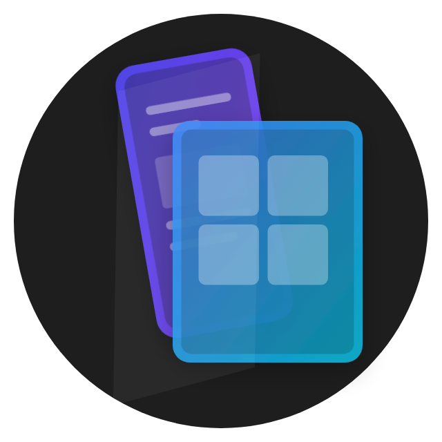

# Humshakals
### The Ultimate Responsive Design Browser 📱💻

**Humshakals** is a powerful browser tool for developers to build, test, and debug responsive web applications. Mirror your website across 20+ devices simultaneously—from the latest iPhones to 4K desktops—with synchronized scrolling, clicks, and interactions.



## 🚀 Key Features

*   **📱 Multi-Device Mirroring:** Preview your site on flagship devices including iPhone 16 Pro Max, Samsung S25 Ultra, and iPad Pro with pixel-perfect accuracy.
*   **👆 Advanced Touch Emulation:** accurate simulation of mobile interactions, including native-feel touch cursors, momentum scrolling, and gesture support.
*   **🔄 Synchronized Testing:**
    *   **Click Sync:** Interaction events are propagated instantly to all devices.
    *   **Navigation Sync:** Unified browsing experience across the entire device suite.
*   **⚡ Performance Core:** Powered by Electron v40 (Chromium 132) for blazing-fast rendering and modern web standards compliance.
*   **🛠 Developer Tools:** Inspect elements, debug issues, and analyze layouts with ease.
*   **📦 Automated Updates:** Seamless background updates ensure you are always running the latest version.

## 📥 Installation

### Windows
1.  Navigate to the [Releases](https://github.com/YOUR_GITHUB_USERNAME/humshakals-pro/releases) page.
2.  Download the latest installer (`.exe`).
3.  Run the installer to launch the application.

### macOS
1.  Navigate to the [Releases](https://github.com/YOUR_GITHUB_USERNAME/humshakals-pro/releases) page.
2.  Download the disk image (`.dmg`).
3.  Drag **Humshakals** to your Applications folder.
    > **Note:** As the binaries are currently unsigned, you may need to Right-Click the app and select "Open" on the first launch to bypass security warnings.

## 🛠 Development

To run Humshakals locally:

```bash
# Clone the repository
git clone https://github.com/YOUR_GITHUB_USERNAME/humshakals-pro.git

# Install dependencies
npm install

# Run in development mode
npm run dev
```

## 📦 Build & Release

To build the application for production:

```bash
# Build for Windows
npm run build:win

# Build for macOS
npm run build:mac

# Build for Linux
npm run build:linux
```

## 📜 License

MIT © Mayur Patil
